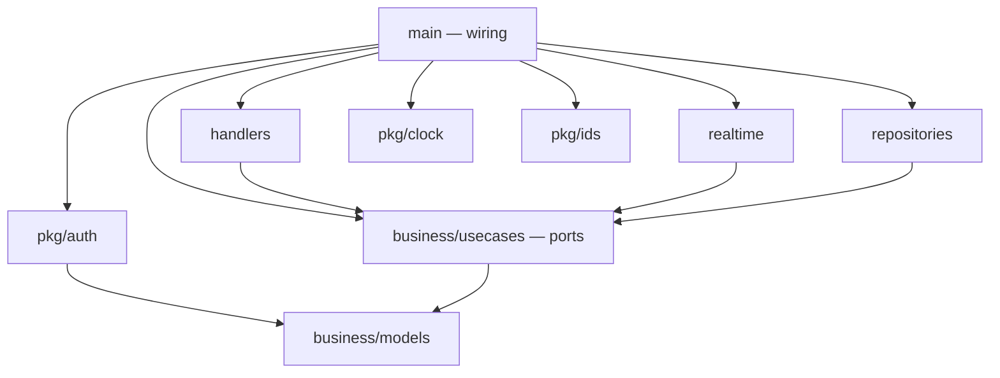

# Support Chat

ระบบแชทซัพพอร์ตแบบ real-time ลูกค้าเปิดเคสพร้อมคำถาม แล้วทีมซัพพอร์ต (agent) เข้ามาตอบในบทสนทนาเดียวกัน หนึ่งเคสมี agent ได้หลายคน

โปรเจกต์นี้ใช้ฝึกโครงสร้างแบบเดียวกับ [oddsteam/api.odds-worklog](https://github.com/oddsteam/api.odds-worklog) และ [oddsteam/web.odds-worklog](https://github.com/oddsteam/web.odds-worklog) ได้แก่ Clean Architecture แบบมี port, TDD, ADR และ Cursor rules

> **ห้ามใช้งานจริง** การ login ใช้แค่ชื่อกับบทบาท ไม่มีรหัสผ่าน ([ADR 0005](docs/adr/0005-simple-jwt-login-behind-authenticator-port.md)) ใครก็ login เป็นใครก็ได้

## ใช้ทำอะไรได้บ้าง

| บทบาท | ทำอะไรได้ |
|---|---|
| ลูกค้า (customer) | เปิดเคสพร้อมคำถามแรก ดูเคสของตัวเอง และแชทในเคสของตัวเอง |
| agent | ดูเคสทั้งหมด (กรองตามสถานะได้) เห็นเคสใหม่ขึ้นมาเองแบบ real-time, join เคส แชท และปิดเคส |

สถานะของเคสเปลี่ยนตามลำดับ: `waiting` (ยังไม่มี agent) → `open` (agent คนแรก join แล้ว) → `closed` (อ่านได้อย่างเดียว) ทุกคนในเคสเห็นข้อความใหม่ทันทีโดยไม่ต้อง refresh

## เทคโนโลยีที่ใช้

| ส่วน | เทคโนโลยี |
|---|---|
| API | Go 1.26, Echo, WebSocket ([coder/websocket](https://github.com/coder/websocket)), MongoDB 8 |
| Web | Next.js 16 (App Router, client components), React 19, TypeScript |
| Test | `go test` + testify, Vitest |
| เครื่องมือ | Docker Compose (MongoDB), Make |

## เริ่มต้นใช้งาน

ต้องมี Go 1.26 ขึ้นไป, Node.js พร้อม npm, Docker และ Make

```bash
make test       # เปิด MongoDB แล้วรัน test ทั้งหมดของ Go และ web
make run-api    # terminal ที่ 1: API ที่ http://localhost:8080
make run-web    # terminal ที่ 2: เว็บที่ http://localhost:3100
```

เปิด http://localhost:3100 แล้ว login เป็นลูกค้าใน tab หนึ่ง และเป็น agent ในอีก tab หนึ่ง จากนั้นแชทหากันได้เลย แต่ละ tab จำ login ของตัวเองแยกกัน

สั่ง `make down` เพื่อปิด MongoDB ข้อมูลยังเก็บอยู่ใน Docker volume

### คำสั่ง make

| คำสั่ง | ทำอะไร |
|---|---|
| `make up` / `make down` | เปิดหรือปิด MongoDB (ผ่าน Docker Compose) |
| `make test` | เปิด MongoDB แล้วรัน test ทั้งหมด งานจะนับว่าเสร็จก็ต่อเมื่อคำสั่งนี้ผ่าน |
| `make test-api` | รัน `go vet` และ `go test -race` ของ API |
| `make test-web` | typecheck และรัน Vitest ของเว็บ (ครั้งแรกจะติดตั้ง npm package ให้ก่อน) |
| `make run-api` | รัน API ที่ port `8080` |
| `make run-web` | รันเว็บที่ port `3100` |

### การตั้งค่า

ฝั่ง API ตั้งผ่าน environment variable:

| ตัวแปร | ค่าเริ่มต้น | ความหมาย |
|---|---|---|
| `PORT` | `8080` | port ของ API |
| `MONGO_URI` | `mongodb://localhost:27017` | connection string ของ MongoDB |
| `MONGO_DB` | `supportchat` | ชื่อ database |
| `JWT_SECRET` | ค่าสำหรับ dev (มี warning ขึ้นใน log) | secret สำหรับ sign token ตอน login ถ้าไม่ได้รันในเครื่องตัวเองต้องตั้งค่านี้เสมอ |
| `WEB_ORIGINS` | `http://localhost:3100` | origin ที่อนุญาตให้เรียก API และเปิด WebSocket ได้ คั่นด้วย comma |

ฝั่งเว็บ: `NEXT_PUBLIC_API_URL` (ค่าเริ่มต้น `http://localhost:8080`)

## โครงสร้างโปรเจกต์

```
.
├── Makefile                  # จุดเริ่มต้นเดียวสำหรับการรันและ test
├── api/                      # Go module ชื่อ "supportchat"
│   ├── business/models/      # entity และ domain error (ใช้แค่ standard library)
│   ├── business/usecases/    # use case ละหนึ่งไฟล์ พร้อม port ที่ประกาศไว้
│   ├── handlers/             # endpoint ของ REST และ WebSocket (Echo)
│   ├── repositories/         # adapter ของ MongoDB
│   ├── realtime/             # hub สำหรับกระจาย event (อยู่ใน memory)
│   ├── pkg/                  # auth (JWT), clock, ids (UUIDv7)
│   └── deployment/local/     # docker-compose ของ MongoDB
├── web/                      # แอป Next.js
│   ├── app/                  # หน้า /login, /cases, /cases/[id]
│   └── lib/                  # โค้ดส่วนเดียวที่คุยกับ API
├── docs/
│   ├── openapi.yaml          # สัญญาของ REST API
│   ├── events.md             # สัญญาของ event ทาง WebSocket
│   ├── adr/                  # บันทึกการตัดสินใจด้านสถาปัตยกรรม (ADR)
│   └── superpowers/          # design spec และ implementation plan
└── .cursor/rules/            # กฎสำหรับผู้ช่วยเขียนโค้ด AI
```

## สถาปัตยกรรม

ทุก dependency ชี้เข้าด้านใน package ใน `business/` ไม่รู้จัก MongoDB, HTTP หรือ WebSocket เลย มันแค่ประกาศ interface (port) ไว้ แล้ว adapter ข้างนอกเป็นคน implement



- **คำสั่งใช้ REST ส่วนการแจ้งเตือนใช้ WebSocket** ([ADR 0003](docs/adr/0003-rest-for-commands-websocket-for-server-events.md)): ข้อความจะถูกบันทึกลง database ก่อน แล้วค่อยส่งต่อให้ทุกคนในเคส ถ้าการเชื่อมต่อหลุดแล้วต่อใหม่ เว็บจะดึงข้อมูลผ่าน REST อีกรอบ ข้อความจึงไม่หาย
- **มี test คอยบังคับกฎ:** `api/architecture_test.go` จะ fail ถ้า `business/` ไป import adapter หรือ library ภายนอก ส่วน `web/lib/architecture.test.ts` จะ fail ถ้าหน้าเว็บเรียก `fetch` หรือเปิด WebSocket เอง

เหตุผลของการตัดสินใจแต่ละข้อและข้อแลกเปลี่ยนอยู่ใน [docs/adr](docs/adr/README.md) ส่วนสัญญาของ API อยู่ที่ [docs/openapi.yaml](docs/openapi.yaml) และ [docs/events.md](docs/events.md)

## สถานะ

| ส่วน | สถานะ |
|---|---|
| Go API | เสร็จแล้ว |
| เว็บ | เสร็จแล้ว |
| E2E test (Cucumber + Playwright + Page Objects) | วางแผนไว้ |

ยังไม่อยู่ในขอบเขตตอนนี้: แนบไฟล์, แสดงว่ากำลังพิมพ์หรืออ่านแล้ว, แจ้งเตือนนอกแอป, เปิดเคสที่ปิดแล้วอีกครั้ง, ค้นหาข้อความ, login ผ่าน Keycloak และการรัน API หลาย instance รายการเต็มอยู่ใน [design spec](docs/superpowers/specs/2026-09-26-support-chat-design.md)
